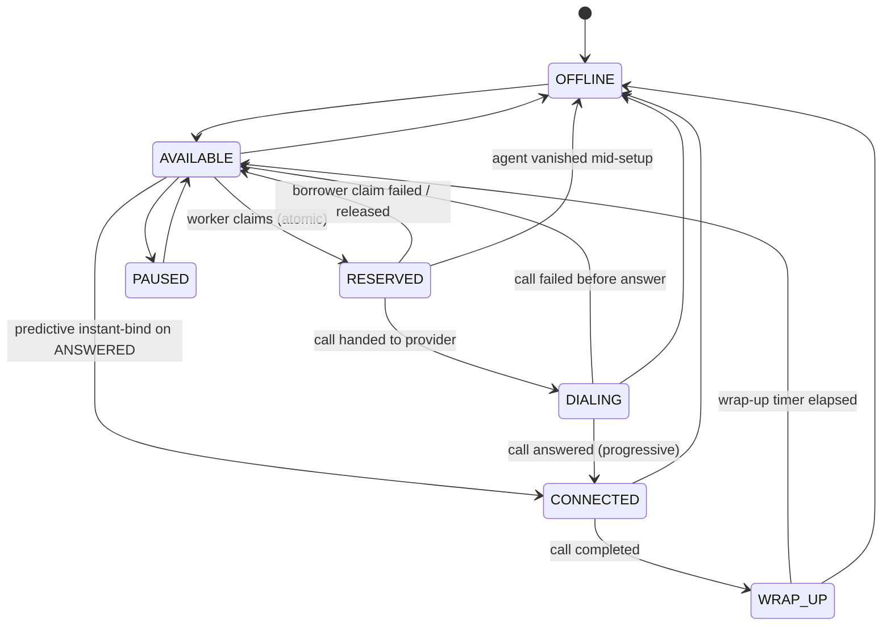

# SmartDialer

A small, working prototype of a collections-campaign dialer that supports both
**Progressive** dialing (one free agent → one call, always safe) and
**Predictive** dialing (dial ahead of agent availability to raise utilization),
with a hard **Safety Controller** boundary between the two dialing strategies
and the telecom provider so that predictive pacing can never itself decide to
place a call.

```
Campaign → Pacing Engine (Progressive / Predictive) → Safety Controller → Call Allocator → Telecom Provider
```

---

## Table of contents

1. [What the system does](#1-what-the-system-does)
2. [Architecture](#2-architecture)
3. [How to run it](#3-how-to-run-it)
4. [Example simulation](#4-example-simulation)
5. [How progressive dialing works](#5-how-progressive-dialing-works)
6. [How predictive pacing works](#6-how-predictive-pacing-works)
7. [How the Safety Controller works](#7-how-the-safety-controller-works)
8. [Concurrency strategy](#8-concurrency-strategy)
9. [Idempotency strategy](#9-idempotency-strategy)
10. [Failure handling](#10-failure-handling)
11. [Scaling discussion](#11-scaling-discussion)
12. [Design tradeoffs](#12-design-tradeoffs)

See also [`ARCHITECTURE.md`](ARCHITECTURE.md) for the short architecture
decision document (why this stack, why this concurrency strategy, why this
pacing algorithm, etc.).

**Repository structure:**

```
smartdialer/
├── engine/                       # the engine — no framework, stdlib + sqlite3 only
│   ├── models.py                 # state machines, transition tables, shared types
│   ├── db.py                     # SQLite connection management, schema
│   ├── agent_store.py            # agent state — atomic reservation guarantee
│   ├── call_store.py             # call state — idempotent/out-of-order-safe events
│   ├── providers.py              # TelecomProvider interface + mock providers
│   ├── pacing.py                 # Progressive & Predictive pacing engines
│   ├── safety.py                 # Safety Controller — independent capacity check
│   ├── allocator.py              # only module allowed to call the provider
│   ├── campaign.py               # orchestrates the loops, builds snapshots
│   └── metrics.py                # EWMA stats, circuit breaker, counters
├── tests/                        # 38 automated tests
├── templates/dashboard.html      # front end for the Flask dashboard
├── simulate.py                   # Scenarios A–D + chaos + safety on/off comparison
├── load_test.py                  # 100/1,000/10,000-agent throughput test
├── web_dashboard.py              # Flask live dashboard (/, /api/metrics)
├── dashboard.py                  # terminal-only live dashboard (stdlib curses)
├── workflow_inspector.py         # interactive backend inspector (pacing log, states)
├── requirements.txt
├── Procfile / render.yaml        # production/deploy config (gunicorn)
├── gunicorn.conf.py              # starts the campaign thread via post_fork
├── README.md                     # this file
├── ARCHITECTURE.md               # architecture decision document
├── DASHBOARD_DEMO.md             # dashboard walkthrough / demo script
└── PRESENTATION_GUIDE.md         # presentation script and talking points
```

---

## 1. What the system does

Collections agents spend time waiting for calls to connect. **Progressive
dialing** fixes idle time by never dialing more than there are free agents —
safe, but agents still sit idle waiting for someone to answer. **Predictive
dialing** starts calls *before* an agent is free, betting that not everyone
answers — better utilization, but if too many people answer at once, a
borrower ends up connected with nobody to talk to them. That's not just bad
UX here — for a collections use case, the brief calls it out directly as a
**compliance risk** (an abandoned connected call).

This prototype implements both modes behind one non-negotiable rule: **the
pacing logic that decides "how aggressively should we dial" never talks to
the telecom provider.** A separate Safety Controller recomputes the actual
safe capacity from ground-truth state every time, and either approves,
reduces, rejects, or forces a fallback to progressive-equivalent behavior.

## 2. Architecture

```
                         ┌────────────┐
                         │  Campaign  │  seeds agents/borrowers, owns the
                         └─────┬──────┘  background control loops
                               │
                               ▼
                    ┌─────────────────────┐
                    │    Pacing Engine     │  "I'd like to start N calls"
                    │ Progressive/Predictive│  — has NO reference to a
                    └─────────┬─────────────┘  provider or allocator at all
                               │ PacingDecisionRequest
                               ▼
                    ┌─────────────────────┐
                    │  Safety Controller   │  recomputes safe capacity from
                    │  (independent check)  │  a FRESH snapshot, ignores the
                    └─────────┬─────────────┘  pacing engine's own numbers
                               │ SafetyDecision (approved count)
                               ▼
                    ┌─────────────────────┐
                    │   Call Allocator     │  the ONLY module allowed to
                    │                       │  touch the provider; binds/
                    └─────────┬─────────────┘  releases agents on events
                               │
                               ▼
                    ┌─────────────────────┐
                    │  Telecom Provider     │  ProviderA (reliable) /
                    │   (mock, pluggable)   │  ProviderB (chaotic)
                    └─────────────────────┘
```

Two background loops (plus one reaper, folded into the pacing loop) run
concurrently against a shared SQLite database:

- **Pacing loop** (1 thread): every tick — reclaim stale state, build a
  snapshot, ask pacing for a number, get it checked by safety, dial the
  approved count.
- **Event workers** (N threads): drain a queue of provider events and apply
  each to the call state machine, reacting with agent-side effects
  (bind an agent on ANSWERED, free it on COMPLETED, etc.).
- **Reaper** (part of the pacing loop tick): reclaims agents/calls left
  behind by a crashed worker once their lease expires.

Module map:

| File | Responsibility |
|---|---|
| `models.py` | State machines, transition tables, shared value types |
| `db.py` | SQLite connection management, schema |
| `agent_store.py` | Agent state — the atomic reservation guarantee lives here |
| `call_store.py` | Call state — idempotent/out-of-order-safe event application |
| `providers.py` | `TelecomProvider` interface + ProviderA / ProviderB mocks |
| `pacing.py` | Progressive & Predictive pacing engines (no provider access) |
| `safety.py` | Safety Controller — independent capacity check |
| `allocator.py` | The only module that calls the provider; binds/releases agents |
| `campaign.py` | Orchestrates the loops, builds snapshots |
| `metrics.py` | Rolling EWMA stats + provider circuit breaker + counters |
| `simulate.py` | Runs Scenarios A–D + chaos + safety on/off comparison |
| `load_test.py` | 100/1,000/10,000-agent throughput test + bottleneck analysis |
| `tests/` | 38 automated tests (concurrency, idempotency, safety, failures) |
| `web_dashboard.py` | Flask live dashboard (`/`, `/api/metrics`) — see [§3](#3-how-to-run-it) |
| `dashboard.py` | Terminal-only live dashboard (stdlib `curses`, no browser needed) |
| `templates/dashboard.html` | Front end for the Flask dashboard |

### Agent state machine



### Call state machine

```mermaid
stateDiagram-v2
    [*] --> QUEUED
    QUEUED --> RESERVED: borrower claimed (atomic)
    RESERVED --> INITIATED: handed to provider
    INITIATED --> RINGING
    RINGING --> ANSWERED
    RINGING --> FAILED: no answer / provider error
    ANSWERED --> CONNECTED: agent bridged (progressive guaranteed; predictive only if one's free)
    ANSWERED --> ABANDONED: no agent free within grace window
    ANSWERED --> FAILED
    CONNECTED --> COMPLETED
    CONNECTED --> FAILED
    QUEUED --> CANCELLED
    RESERVED --> CANCELLED
    INITIATED --> CANCELLED
    RINGING --> CANCELLED
    COMPLETED --> [*]
    FAILED --> [*]
    CANCELLED --> [*]
    ABANDONED --> [*]
```



`ABANDONED` is not in the assignment's minimum state list — it's added
deliberately. See [§5](#5-how-progressive-dialing-works)/[§6](#6-how-predictive-pacing-works)
for why it matters.

## 3. How to run it

Requires Python 3.10+ (the core engine is stdlib-only — `sqlite3` — the web
dashboard additionally needs `flask`, and `pytest` is needed for tests).

```bash
git clone <this-repo-url> smartdialer
cd smartdialer                               # repo root: this is where
                                              # README.md / simulate.py live
python3 -m venv .venv && source .venv/bin/activate   # or use --break-system-packages
pip install -r requirements.txt

# run the test suite (38 tests, ~15s)
python3 -m pytest tests/ -v

# run the simulation (Scenarios A-D + chaos demo + safety comparison)
python3 simulate.py            # full run, ~35s
python3 simulate.py --fast     # shorter run, ~15s, for quick iteration

# run the load test (100/1,000/10,000 agents)
python3 load_test.py           # full run, ~30s
python3 load_test.py --fast    # shorter run, ~15s
```

Everything above runs from a clean checkout with no external services, no
Docker, no network access required — just Python's stdlib `sqlite3`.

### Web Dashboard for display

A small Flask app (`web_dashboard.py`) runs a real `Campaign` in the
background and serves a live-updating view of it at `http://localhost:9000`
— agent/call state distribution, answer/abandon/provider-health metrics,
refreshed every 500ms via `/api/metrics`.

```bash
python3 web_dashboard.py                     # http://localhost:9000
```

There's also a terminal-only version with no browser/Flask dependency at
all, using nothing but stdlib `curses` (`d`/`o`/`c` keys inject the same
failure scenarios `simulate.py` runs on a fixed schedule, live, so you can
watch the Pacing Engine / Safety Controller react in real time):

```bash
python3 dashboard.py --agents 25 --mode predictive
```

To run the web dashboard behind a production WSGI server instead of Flask's
dev server (e.g. for a deployed demo link), use the included `Procfile`:

```bash
gunicorn web_dashboard:app --workers 1 --threads 4 --bind 0.0.0.0:$PORT
```

`--workers 1` is required — each worker process would otherwise start its
own independent in-memory campaign, so requests would land on whichever
worker's campaign happened to handle them.

## 4. Example simulation

A real run of Scenario A (20% answer rate, 120s average talk time,
predictive mode, 30 agents, 1,000 borrowers):

```
SCENARIO A: answer_rate=20%, avg_talk_time=120s (predictive mode)
  calls initiated           : 328 (progressive=52, predictive=276)
  calls answered            : 60
  calls abandoned           : 0   <-- the compliance-risk metric
  recent answer rate (EWMA) : 0.290
  safety: approve/reduce/reject/fallback = 0/68/0/2
  sample pacing decision (mid-run):
    requested=54 approved=4 action=REDUCE
    reason: requested 54 exceeds safe unbound capacity 4; reduced to 4
```

The most telling number across every scenario run (A/B/C/D, chaos, and the
safety on/off comparison below) is **`calls abandoned = 0`** with the Safety
Controller active. Turning it into a deliberately reckless configuration
(same pacing engine, same seed, same call volume) produces a **28% abandon
rate**:

```
BONUS: Safety Controller ON vs a deliberately reckless one (same seed)
  [safety_on]       answered=37 abandoned=0  abandon-of-answered-rate=0.0%
  [safety_reckless] answered=57 abandoned=16 abandon-of-answered-rate=28.1%
```

That's the entire value proposition of this architecture in one comparison:
the pacing engine didn't change at all between the two runs.

## 5. How progressive dialing works

Progressive dialing binds an agent to a call **before the phone ever rings**:

1. Pacing Engine requests `min(available_agents, ...)` — literally just
   "one call per free agent."
2. Safety Controller caps it at `available_agents` (nothing to reduce here —
   it's already the simplest possible safe number, but the check still runs,
   because the Safety Controller is the *only* thing allowed to authorize a
   dial, regardless of mode).
3. Call Allocator atomically reserves one specific agent
   (`try_reserve_any_available`), atomically claims one queued borrower
   (`try_claim_borrower`), creates the call row *with the agent already
   attached*, and only then calls the provider.
4. If claiming the borrower fails after the agent was reserved, the agent is
   released back to `AVAILABLE` immediately — no dangling reservation.
5. If the call fails before being answered, the bound agent is released.
6. If the agent goes `OFFLINE` mid-setup (disappears), the cascading handler
   in `agent_store.set_offline()` returns the call it was bound to, and the
   allocator marks that call `FAILED` instead of leaving it stuck.

Because the agent is bound before dialing, a progressive call can **never**
produce an abandoned-connected-call outcome — there's structurally nowhere
for that failure mode to come from.

## 6. How predictive pacing works

Predictive calls are placed **without** an agent bound — that's the entire
point (dial ahead of certainty). The risk is exactly what the brief
describes: the borrower answers and there's no agent free. This system
handles that risk explicitly instead of hoping it doesn't happen:

- `_handle_answered()` in `allocator.py` tries to atomically bind a free
  agent the instant a predictive call is answered
  (`try_connect_any_available` — a single atomic `AVAILABLE → CONNECTED`
  update, not two separate steps).
- If none is free, it retries for a short grace window
  (`answer_bind_grace_seconds`, default 0.4s scaled) — deliberately short,
  because a long wait with a live borrower on the line **is** the compliance
  risk, not a way around it.
- If still no agent, the call transitions to `ABANDONED` — a dedicated
  terminal state (not lumped into generic `FAILED`) specifically so this
  outcome is separately countable and feeds back into the pacing math.

**The pacing formula** (see `pacing.py` for the fully commented version):

```
expected_conversions = ringing_unbound_calls × recent_answer_rate
free_capacity         = max(0, available_agents − expected_conversions)
dial_multiplier        = min(1 / max(recent_answer_rate, floor), max_multiplier)
raw                    = free_capacity × dial_multiplier
margin                 = base_margin + min(0.5, abandon_rate × 4)
requested              = floor(raw × provider_health × (1 − margin))
```

In words: *"How much agent capacity isn't already spoken for by calls
already in flight? Given how often people actually answer, how many dials
does it take to fill that capacity? Shrink that by how healthy the provider
is and by a safety margin that widens automatically if abandonment or
provider errors start showing up."*

Every one of those numbers is written into `request.explanation`, so
**"why did the system decide to initiate X calls instead of Y?"** always has
a concrete, inspectable answer — never a vibe. Example from a real run:

```json
{
  "available_agents": 20, "ringing_unbound_calls": 6,
  "recent_answer_rate": 0.29, "expected_conversions_from_inflight": 1.74,
  "free_capacity": 18.26, "dial_multiplier": 3.45,
  "raw_before_margin": 63.0, "provider_health": 1.0,
  "dynamic_safety_margin": 0.15,
  "formula": "requested = floor((available_agents - ringing_unbound*p) * min(1/p, max_mult) * provider_health * (1 - margin))"
}
```

## 7. How the Safety Controller works

The Safety Controller receives a `PacingDecisionRequest` — one integer
(`requested`) plus an explanation dict — and **does not trust the
explanation dict for anything that affects the approved number.** It builds
its own `Snapshot` straight from `AgentStore`/`CallStore` (the real source of
truth) at evaluation time, independent of whatever the pacing engine saw.
(`test_safety_controller_ignores_pacing_engines_own_explanation` proves this
directly — it feeds the safety controller a request whose `explanation`
lies about agent availability and confirms the approved number is based
only on the real Snapshot.)

**Progressive requests**: hard-capped at `available_agents`. Nothing more
to compute.

**Predictive requests**: independently computes how many *unbound* calls
may safely be in flight —

```
overdial_factor    = base_overdial_factor × provider_health
                        × (0 if circuit_open else 1)
                        × (0 if abandon_rate > threshold else 1)
                        × (0 if still in hysteresis recovery else 1)
safe_unbound        = max(0, floor(available_agents × overdial_factor)
                              − already_in_flight_unbound)
approved            = min(requested, safe_unbound)
```

If `overdial_factor` collapses to zero (bad provider health, an open
circuit breaker, recent abandonment, or still recovering from one of those),
`safe_unbound` collapses to zero too — which **is** `FALLBACK_TO_PROGRESSIVE`
mode: no special-cased bypass, just the natural output of the same formula
when conditions are unsafe. The approved count in that case is capped at
`available_agents`, exactly like progressive mode, and the allocator is told
to dial in progressive mode for that batch.

**Hysteresis**: recovering from an unsafe condition requires several
consecutive healthy snapshots (`hysteresis_ticks_required`, default 3)
before predictive overdial is allowed again, so the system doesn't flap
approve/fallback/approve every 150ms when a metric is hovering near a
threshold.

Every decision, whichever action it takes, is logged with the full
`details` dict to the `pacing_log` SQLite table and to `campaign.pacing_log`
in memory, so any decision can be replayed and explained after the fact.

## 8. Concurrency strategy

**The guarantee**: two workers must never reserve the same agent (or claim
the same borrower, or apply the same call-state transition) concurrently.

**The mechanism**: every claim/transition is a *single* atomic conditional
`UPDATE`:

```sql
UPDATE agents SET state='RESERVED', ... WHERE agent_id=? AND state='AVAILABLE'
```

SQLite serializes all writer transactions against the database file, so of
two simultaneous UPDATEs targeting the same row, exactly one can see
`state='AVAILABLE'` and match the `WHERE` clause — the other affects zero
rows, which we detect via `cursor.rowcount`. This is deliberately **not** a
Python `threading.Lock`: a Python lock only protects threads inside one
process, which is useless once you have multiple real worker
processes/machines. The same `UPDATE ... WHERE` pattern, pointed at Postgres
with row-level locking, keeps its correctness guarantee unchanged — this is
exactly the compare-and-set pattern you'd use there too (or with an
optimistic version column). Swapping the storage engine is a connection
string change, not a redesign.

`test_agent_concurrency.py::test_only_one_worker_wins_the_race` proves this
directly: 25 threads hit a `threading.Barrier` and call
`try_reserve_agent("agent-1", ...)` at, as close as the OS scheduler
allows, the exact same instant. Exactly one succeeds, every time (also
re-run 30 times over fresh agents in
`test_race_repeated_many_times_stays_correct` to rule out a lucky
interleaving).

Every other contended resource in the system uses the identical pattern:
borrower claiming, call-state transitions, and the predictive "instant
bind" of a free agent to an answered call. One mental model, applied
consistently everywhere it's needed — see `agent_store.py`, `call_store.py`.

## 9. Idempotency strategy

Provider events are assumed to be actively hostile: duplicated, reordered,
or simply never arriving. `CallStore.apply_event` layers two independent
defenses:

1. **Idempotency-key dedup.** `processed_events(event_key)` has a `PRIMARY
   KEY` on the key; a redelivered event with the *same* key fails the
   `INSERT` and is dropped immediately.
2. **Transition-table validation.** Even a duplicate with a *fresh* key (a
   provider that retried with a new message id — ProviderB deliberately
   does this) or a genuinely out-of-order event is only applied if it's a
   legal forward transition from the call's *current* state
   (`CALL_TRANSITIONS` in `models.py`). `ANSWERED` while already `ANSWERED`
   is a no-op. Anything arriving after a terminal state
   (`COMPLETED`/`FAILED`/`CANCELLED`/`ABANDONED`) is discarded as stale.

This means the exact scenarios in the brief are covered directly:

- `ANSWERED, ANSWERED, ANSWERED, COMPLETED` → exactly one transition to
  `ANSWERED`, the rest are no-ops (`test_duplicate_answered_events_only_transition_once`).
- `COMPLETED, ANSWERED, RINGING` → after the state reaches a terminal value,
  later events are ignored, never rewind it
  (`test_out_of_order_events_after_terminal_state_are_ignored`).

Both the dedup `INSERT` and the state `UPDATE` are single atomic statements,
so two threads processing events for the *same* call concurrently can't
race each other either (`test_concurrent_event_application_for_same_call_is_race_free`).

## 10. Failure handling

| Scenario | What happens |
|---|---|
| **Worker crash** (agent reserved → borrower reserved → call initiated → crash) | Every reservation carries a lease (`lease_expires_at`). A background reaper (folded into the pacing loop tick) reclaims agents whose lease expired back to `AVAILABLE`, and reconciles stale in-flight calls to `FAILED` (`outcome='stale_reconciled'`). Nothing leaks permanently. See `test_worker_crash_does_not_leak_agent_or_call`. |
| **Provider outage** | Provider health (EWMA of provider-side errors, *excluding* normal no-answer outcomes — see §12) drops, the circuit breaker opens after sustained bad health, and the Safety Controller's `overdial_factor` collapses to zero, forcing `FALLBACK_TO_PROGRESSIVE`. Existing in-flight calls either complete or fail on their own timelines; new predictive overdial simply stops. |
| **Sudden agent drop** (100 → 60 in a few seconds) | `Campaign.simulate_agents_disappear(n)` force-sets N agents `OFFLINE` and cascade-fails any call they were bound to. The *next* pacing tick (every ~150ms) builds a fresh snapshot from `AgentStore.counts()` — there's no cache to go stale, so reduced capacity is reflected within one tick. |
| **Duplicate events** | See §9 — deduped, at most one logical transition. |
| **Out-of-order events** | See §9 — rejected by transition-table validation, state never corrupts. |
| **Sudden answer-rate degradation** (70% → 10%) | `RollingStats` is EWMA-based (decay 0.85 by default), so a real shift shows up within a handful of calls, not diluted by months of history. The pacing engine's `dial_multiplier` grows as the estimate drops (needs more dials per expected connect), but the Safety Controller's independent `safe_unbound_capacity` — not the pacing engine's request — remains the deterministic ceiling. |

## 11. Scaling discussion

See `load_test.py`'s full analysis (also summarized in `ARCHITECTURE.md`).
Short version: a naive candidate-selection query was the *first* bottleneck
found (missing composite index caused an `O(n)` sort on every reservation
attempt — measured, not assumed, via `EXPLAIN QUERY PLAN`), fixed with an
index. After that fix, throughput is flat across 100/1,000/10,000 agents
(~2,500–3,300 attempts/sec) and the real remaining ceiling is SQLite's
single-writer transaction serialization. Production fix: Postgres with
row-level locking (or `SELECT ... FOR UPDATE SKIP LOCKED`), sharded agent
pools, and a real message broker for event ingestion instead of one
in-process queue.

## 12. Design tradeoffs

- **SQLite instead of Postgres/Redis/Kafka.** The interesting problem here
  is the *correctness pattern* (atomic conditional updates), not the engine.
  SQLite makes that pattern trivially correct to demonstrate and lets the
  whole prototype run with zero external services. The tradeoff is a real,
  documented throughput ceiling — see §11 — which is exactly why the load
  test exists: to find that ceiling honestly instead of asserting it away.
- **Real threads + scaled real-time sleeps for provider simulation**,
  instead of a discrete-event virtual clock. Simpler to implement correctly
  and it exercises *genuine* concurrent, out-of-order event delivery (real
  OS thread scheduling) rather than a simulated illusion of it — at the
  cost of the simulation not being perfectly wall-clock-deterministic
  between runs (see §4 and the note in `simulate.py`). Provider *outcome*
  distributions are still seeded and reproducible.
- **`ABANDONED` as its own terminal call state**, beyond the assignment's
  minimum list. This is a compliance-relevant outcome distinct from a
  generic `FAILED`, and keeping it separate is what makes it directly
  visible to both the metrics report and the Safety Controller's abandon-
  rate circuit breaker.
- **Provider health explicitly excludes normal "no answer" outcomes.** An
  earlier version of this code conflated "borrower didn't pick up" with
  "provider is unhealthy," which meant a low-answer-rate campaign (like
  Scenario A, 20%) would wrongly degrade provider health and trigger
  provider-based fallback even with a perfectly healthy provider. Fixed by
  tagging `FAILED` events with an `outcome` (`no_answer` vs
  `provider_error`/`timeout`) and only counting the latter against health.
  This was caught during end-to-end manual testing, not assumed correct
  from the design doc — worth naming because keeping "answer rate" and
  "provider health" as genuinely independent signals is exactly what lets
  the Safety Controller react differently to each (see §7 and §10).
- **Grace window on predictive answer-to-agent binding is short by
  design** (0.4s scaled), not tuned to "whatever minimizes abandonment."
  A longer wait would reduce the abandon count in the metrics but make the
  underlying compliance problem *worse* (a live, unattended borrower for
  longer), so the fix for high abandonment is meant to be "dial less
  aggressively" (Safety Controller), not "wait longer once it's already
  happened."


